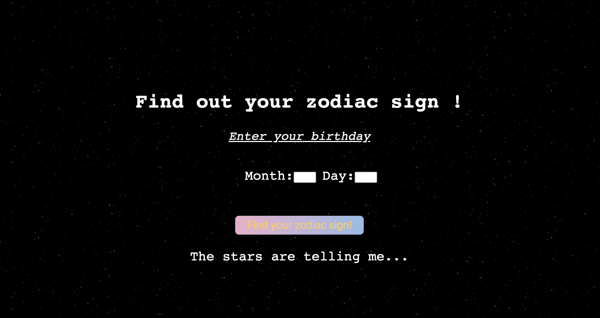

<h1>Horoscope</h1>

<i>Create a Zodiac Sign/Horoscope generator which shows the user's corresponding zodiac sign when they enter their birthday.</i>



<strong>How It's Made</strong>

<i>Tools Used: </i>HTML5, CSS3, JavaScript

After creating the wireframe for the project, including the buttons and where certain images, inputs, and texts would appear,
I began to write in my JavaScript how I would make the functions of the site work.

For the Month and Day inputs, I created a Min-Max so that the user could not exceed proper dates when using the up & down arrow buttons.
```
MONTHS min="1" max="12"
DAY min="1" max="31"
```

In my JavaScript I put my images in an Array and called upon them according to the corresponding dates of the "Zodiac Calender".
I made strings-including a short "description" of the different zodiac types, and their name- which appeared on the DOM only under the
specific conditions.
```
if ((month == 3 && day >=21) || (month == 04 && day <= 19)){
    result = ("You are an Aries!")
    document.getElementById('result').innerHTML=("You are an Aries")
```

<strong>Lessons Learned</strong>

This project is one of the first created when I began to learn JavaScript. At the point in time where I was
making this, I had trouble understanding certain syntax in simple things like, not knowing exactly what a "queryselector" is, or how I should use it.
Now I have found that it is similar to ```document.GetElementsByClassName```, but ```document.querySelector``` is most preferable, for reasons
which I assume are similar to the reason why it's preferred to use ```Let``` rather than ```var```.
But in my projects beyond this one I continue to slowly learn more very helpful tips that really enforce the reasoning that
everything becomes better with <i>experience</i>.
